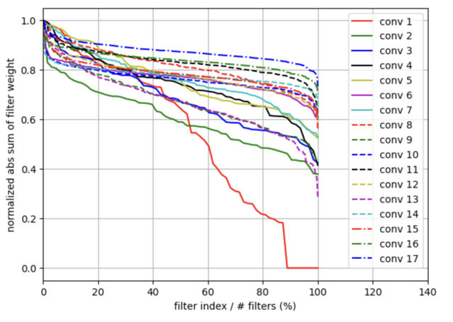

# Install dependencies
```bash
git clone  https://github.com/Durhamfighter/OptimizationResnet/
pip install -r requirements.txt
```

# Filter Structure Pruning

The below figure is filter importance according to L1 norm.



To adjust the number of filters to prune, modify the following in `main.py`:

```python
len(steps)  # Adjust this value as needed
```

Make sure to review structured_pruning.ipynb to understand the structure pruning process.

# Quantization Awareness Training

updating..
